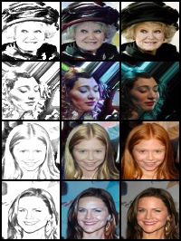
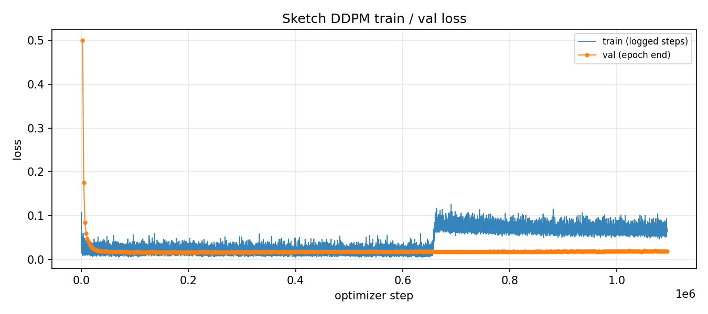
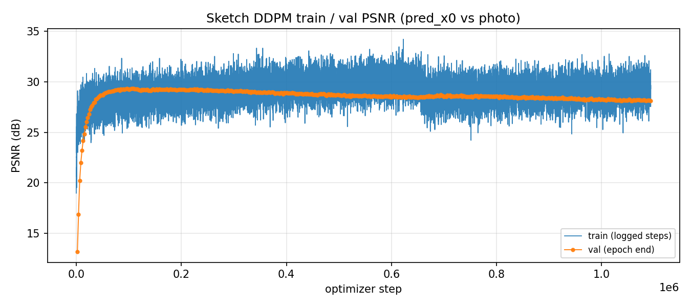
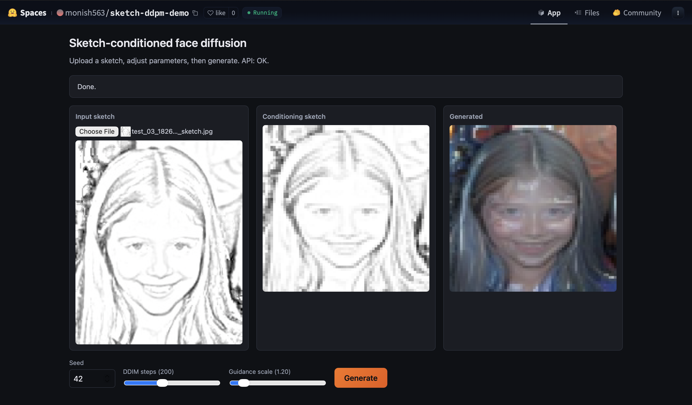

# MSAI_Image_Generation

Sketch-conditioned diffusion model that generates aligned face images from a sketch. Uses pixel-space DDPM (UNet + DDIM) with EMA, CFG dropout, LPIPS, and an optional Lab color loss. Sketches are generated deterministically from each photo via the OpenCV "dodge" pipeline, so the conditioning signal is perfectly aligned to the target.

- Dataset: [CelebA on Kaggle](https://www.kaggle.com/datasets/jessicali9530/celeba-dataset)
- Live demo (Gradio): [Hugging Face Space - monish563/sketch-ddpm-demo](https://huggingface.co/spaces/monish563/sketch-ddpm-demo)
- Full engineering history: [`docs/DEVLOG.md`](docs/DEVLOG.md)

---

## Installation & Run

```bash
python3 -m venv .venv && source .venv/bin/activate
pip install -U pip
pip install -r requirements.txt

# train
python -m src.train --data-root ./data --batch-size 32 --amp \
  --image-size 64 --beta-schedule cosine --drop-sketch-prob 0.1 \
  --sample-steps 200 --guidance-scale 1.2

# evaluate on held-out CelebA partition 2 (with FID)
python -m src.eval_test --ckpt ./checkpoints/ckpt_best.pt --fid \
  --triplet-png ./checkpoints/eval_test/test_triplets.png
```

Place CelebA under `./data/` (`list_eval_partition.csv` + `img_align_celeba/`; nested layout auto-detected). Quest SLURM entrypoints live in [`slurm/`](slurm/).

---

## Results

Final triplets `[sketch | generated | ground-truth]`:


Held-out test sample:



Learning curves:





Training progression video:

[<video src="assets/train.mp4" controls width="640"></video>](https://github.com/user-attachments/assets/53200c51-05a1-4cbd-aa7f-4f01e3f13e44)

---

## Extra Criteria pursued

- **GUI** - Gradio app deployed on Hugging Face Spaces ([live demo](https://huggingface.co/spaces/monish563/sketch-ddpm-demo)). Source in the sibling [`sketch-ddpm-demo/`](../sketch-ddpm-demo/) folder ([`app.py`](../sketch-ddpm-demo/app.py)).

  

> \* Output images may look blurry because the model trains at **64x64** and the displayed images are scaled up.

- **Distributed training** - PyTorch `torchrun --nproc_per_node=N -m src.train_ddpm ...` was exercised during the human-sketch (Sketchy) phase to scale throughput. See [`docs/DEVLOG.md`](docs/DEVLOG.md).
- **Tracking** - per-run `metrics.csv` and TensorBoard scalars (`train/loss`, `train/psnr`, `train/lr`, `val/loss`, `val/psnr`).
- **HPO** - 12-bundle Stage-2 hyperparameter search with shared rubric in [`docs/hyperparam_run_matrix.md`](docs/hyperparam_run_matrix.md), driven by [`slurm/quest_stage2_hyperparam_search.sh`](slurm/quest_stage2_hyperparam_search.sh) and per-case notebooks in [`notebooks/stage2_cases/`](notebooks/stage2_cases/).
- **MLOps** - reproducible Quest SLURM scripts ([`slurm/quest_stage1_baseline.sh`](slurm/quest_stage1_baseline.sh), [`slurm/quest_stage2_hyperparam_search.sh`](slurm/quest_stage2_hyperparam_search.sh)) that train + evaluate in a single job.

---

## Difficulties & how solved

- **Human-drawn sketches gave poor conditioning.** Early Sketchy runs were blurry and misaligned. Solved by pivoting to CelebA with **synthetic OpenCV-dodge sketches** (deterministic and exactly aligned to the target photo).
- **Background clutter and color drift at 64x64.** Solved by tightening the training stack (cosine beta schedule, LPIPS aux loss, EMA, CFG dropout) and adding a **Lab `a*b*` color loss** (`color_ab_l1` in [`src/train.py`](src/train.py)).
- **FID is slow on the full test split.** Solved by sampling a fixed subset via `--fid-max` (default 1024) instead of all ~20k partition-2 images.

Full chronological history: [`docs/DEVLOG.md`](docs/DEVLOG.md).
