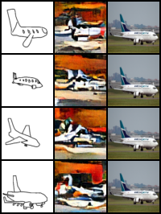
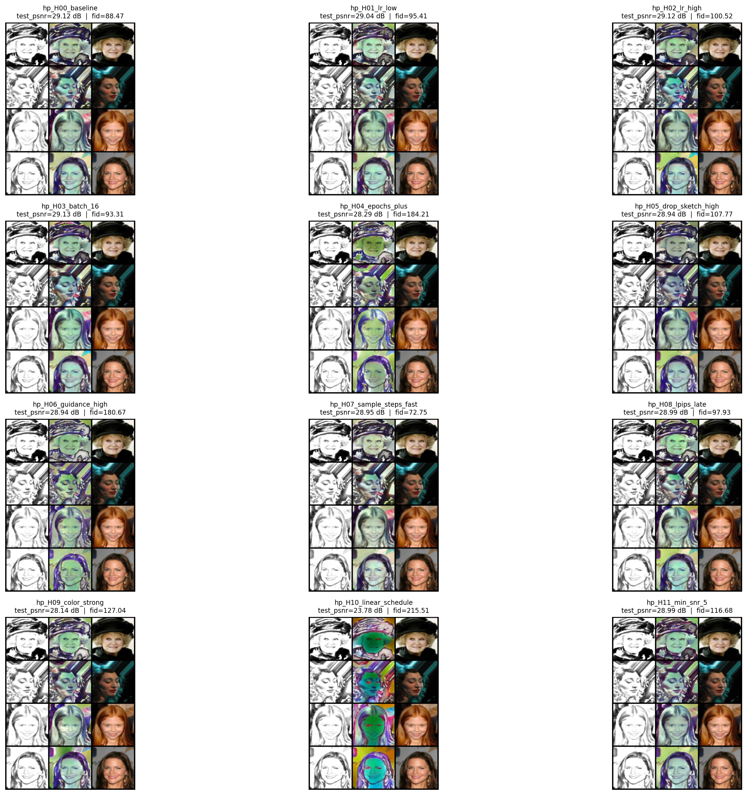

# MSAI_Image_Generation Devlog

Short version of what we did, what failed, and what worked.

- Main docs: [`../README.md`](../README.md)
- Hyperparameter matrix: [`./hyperparam_run_matrix.md`](./hyperparam_run_matrix.md)

## One-minute summary

- Started with **Sketchy** (human sketches -> photos).
- Tried many training improvements (EMA, CFG dropout, cosine schedule, Min-SNR, LPIPS, wider UNet, distributed training).
- Quality still poor because **human sketches were noisy/misaligned** and class diversity was high.
- Pivoted to **CelebA + synthetic sketches** (generated from each photo). Big quality jump.
- Built a second iteration to improve:
  - cleaner conditioning signals
  - color faithfulness (Lab color loss)
  - repeatable hyperparameter search workflow

---

## Timeline at a glance

| Window | Phase | Outcome |
|---|---|---|
| Apr 26 -> Apr 30 | Sketchy era (`38d7657` -> `b7aac8b`) | Better training stack, weak visuals |
| May 2 | CelebA pivot (`b698b35`) | Major improvement from aligned conditioning |
| Post-pivot | CelebA runs (first iteration) | Multiple checkpoint runs + Tier-A sweeps |
| Next | Second iteration | Color-loss + Stage-2 search |

---

## Phase 1 - Bootstrap

### `95dc356` Initial commit

- Placeholder README only.
- No model/data pipeline yet.

---

## Phase 2 - Sketchy era (why it failed)

### Why Sketchy was chosen

Sketchy matched the original goal (structure-guided generation across many categories), so it was a reasonable first choice.  
Human-sketch dataset source: [Kaggle - Sketch to Image (ankitsheoran23)](https://www.kaggle.com/datasets/ankitsheoran23/sketch-to-image).

### Major things we tried

- Built full training/eval stack for Sketchy.
- Fixed dataset paths and split leakage issues.
- Added sampling + eval scripts.
- Added modern training knobs:
  - EMA
  - CFG dropout
  - cosine LR + warmup
  - Min-SNR weighting
  - LPIPS aux loss
  - wider UNet
- Tried distributed training (`torchrun`) for throughput.

### Why quality stayed bad

1. **Too much category diversity** for available per-class data density.
2. **Human sketch mismatch** (geometry/style drift from target photos).
3. **More compute helped speed, not information quality**.

### Visual evidence (human sketch failure)

This example shows how weak the human-sketch conditioning results were:

---

## Phase 3 - Pivot to CelebA (`b698b35`)

### What changed

Sketchy-specific files removed, CelebA pipeline added:

- Added: `src/celeba.py`, `src/sketch.py`, `src/train.py`, `src/unet.py`
- Removed: `build_sketchy_splits.py`, `sketchy_dataset.py`, `train_ddpm.py`, `unet_conditional.py`, and old eval/sample scripts

### Why this worked better

- CelebA is single-domain and aligned.
- Synthetic sketches are generated from the exact photo (strong alignment).
- Existing training improvements became effective once conditioning noise dropped.

---

## Phase 4 - CelebA iteration (first iteration)

### Runs used for comparison

- `checkpoints/`
- `checkpoints_2/`
- `checkpoints_3/`

### Eval/training workflow

- Tier-A sweep script
- Quest SLURM trainer

### What improved and what remained

- 128x128 deeper UNet runs clearly outperformed early 64x64 runs.
- Remaining issues before the second iteration:
  - background clutter leaking into sketch signal
  - color drift (skin/hair) despite LPIPS

---

## Phase 5 - Second CelebA iteration

Focus: clean conditioning + better color realism + structured run matrix.

### New ingredients

1. **Color-faithfulness loss**
   - `color_ab_l1` in [`../src/train.py`](../src/train.py)
   - Flags: `--color-loss-weight`, `--color-loss-start-frac`, `--color-loss-ramp-steps`
   - Not present in the first-iteration `train.py`

2. **Two-stage execution**
   - Stage 1 baseline: [`../slurm/quest_stage1_baseline.sh`](../slurm/quest_stage1_baseline.sh)
   - Stage 2 search: [`../slurm/quest_stage2_hyperparam_search.sh`](../slurm/quest_stage2_hyperparam_search.sh)

3. **Per-case + analysis notebooks**
   - [`../notebooks/stage2_cases/`](../notebooks/stage2_cases/)

4. **Run matrix + rubric**
   - [`./hyperparam_run_matrix.md`](./hyperparam_run_matrix.md)

---

## Stage 2 run matrix (quick reference)

Overrides from [`./hyperparam_run_matrix.md`](./hyperparam_run_matrix.md):

- `H00_baseline`: none
- `H01_lr_low`: `--lr 1e-4`
- `H02_lr_high`: `--lr 3e-4`
- `H03_batch_16`: `--batch-size 16`
- `H04_epochs_plus`: `--epochs 55`
- `H05_drop_sketch_high`: `--drop-sketch-prob 0.2`
- `H06_guidance_high`: `--guidance-scale 2.0`
- `H07_sample_steps_fast`: `--sample-steps 120`
- `H08_lpips_late`: `--lpips-start-frac 0.25`
- `H09_color_strong`: `--color-loss-weight 0.05`, `--color-loss-start-frac 0.45`
- `H10_linear_schedule`: `--beta-schedule linear`
- `H11_min_snr_5`: `--min-snr-gamma 5`

Shared defaults currently documented there include:

`--image-size 64 --batch-size 32 --epochs 75 --lr 2e-4 --seed 42 --timesteps 1000 --beta-schedule cosine --min-snr-gamma 0 --guidance-scale 1.5 --sample-steps 200 --sample-every 2000 --drop-sketch-prob 0.1 --lpips-start-frac 0.1 --color-loss-weight 0.02 --color-loss-start-frac 0.6 --color-loss-ramp-steps 5000 --early-stop-patience 0 --early-stop-min-delta 0 --max-train-images 70000 --amp`

---

## Hyperparameter results

### Stage 1 baseline

Source: [`../checkpoints/stage1_baseline/`](../checkpoints/stage1_baseline/)

| Metric | Value |
|---|---|
| `last_step` | 1,093,500 |
| `val_loss` | 0.018936 |
| `val_psnr` | 28.11 |
| `test_psnr_db` | 29.17 |
| `test_ddpm_loss` | 0.01652 |
| Triplet PNG | [`../checkpoints/stage1_baseline/eval_test/test_triplets.png`](../checkpoints/stage1_baseline/eval_test/test_triplets.png) |
| Notes | Reference run; long schedule (~1.09M steps), FID 37.57 at `guidance_scale=1.2`, `sample_steps=200`. |

### Stage 2 table

| Run | Override | val_loss | val_psnr | test_psnr_db | test_fid | Notes |
|---|---|---:|---:|---:|---:|---|
| H00_baseline | none | 0.017219 | 28.55 | 29.12 | 88.47 | reference |
| H01_lr_low | `--lr 1e-4` | 0.017991 | 28.49 | 29.04 | 95.41 | slightly worse than baseline |
| H02_lr_high | `--lr 3e-4` | 0.017893 | 28.56 | 29.12 | 100.52 | matches baseline PSNR; FID worse |
| H03_batch_16 | `--batch-size 16` | 0.018118 | 28.59 | 29.13 | 93.31 | best val_psnr & test_psnr; ran 2x steps (336,875) |
| H04_epochs_plus | `--epochs 55` | 0.018161 | 28.29 | 28.29 | 184.21 | stopped early at 120,285 steps; weakest |
| H05_drop_sketch_high | `--drop-sketch-prob 0.2` | 0.017297 | 28.38 | 28.94 | 107.77 | slight regression |
| H06_guidance_high | `--guidance-scale 2.0` | 0.017458 | 28.38 | 28.94 | 180.67 | PSNR ~baseline, FID hurt |
| H07_sample_steps_fast | `--sample-steps 120` | 0.017408 | 28.52 | 28.95 | 72.75 | best test_fid |
| H08_lpips_late | `--lpips-start-frac 0.25` | 0.017387 | 28.48 | 28.99 | 97.93 | near baseline |
| H09_color_strong | `--color-loss-weight 0.05`, `--color-loss-start-frac 0.45` | 0.018681 | 28.23 | 28.14 | 127.04 | stronger color loss hurts both metrics |
| H10_linear_schedule | `--beta-schedule linear` | 0.009757 | 21.49 | 23.78 | 215.51 | low val_loss is misleading; PSNR & FID much worse |
| H11_min_snr_5 | `--min-snr-gamma 5` | 0.005337 | 28.49 | 28.99 | 116.68 | val_loss not comparable (Min-SNR reweighting); PSNR ~baseline |

### Selection placeholders

- Best numeric run: `H03_batch_16` on `val_psnr` (28.59) and `test_psnr_db` (29.13). Caveats: `H11_min_snr_5`'s `val_loss` (0.005337) and `H10_linear_schedule`'s `val_loss` (0.009757) are not directly comparable to other runs because Min-SNR and the linear schedule change the loss weighting; H10's PSNR/FID confirm it is actually worse.
- Best `test_fid`: `H07_sample_steps_fast` (72.75).
- Best visual run (rubric): side-by-side eval triplets for all 12 runs (3×4 grid: sketch | generated | ground truth per [`hyperparam_run_matrix.md`](hyperparam_run_matrix.md) rubric axes).

  

  Visually and by `test_fid`, **`H07_sample_steps_fast`** is the strongest; **`H10_linear_schedule`** is clearly the weakest (color breakdown, highest FID). **`H03_batch_16`** remains the best scalar match to GT on **`test_psnr_db`** among runs that looked acceptable; many configs still show skin/hair color drift vs. GT.
- Stage-B follow-up plan: re-run eval (`python -m src.eval_test`, varying guidance / sample steps) for `H03_batch_16`, `H07_sample_steps_fast`, and `H00_baseline`; rubric scoring on top-3 visual outputs; if `H03_batch_16` confirms, sweep `batch-size` and longer training.
- Best Tier-A combo (`sample_steps`, `guidance_scale`): `TODO - pending Tier-A grid runs`.

---

## Crisp takeaways

1. **Conditioning quality beat optimizer complexity.**
2. **Aligned synthetic sketches beat human sketches for this setup.**
3. **Color-aware loss is a practical win for skin/hair consistency.**
4. **Use run-matrix + rubric, not a single scalar, to pick final checkpoints.**
